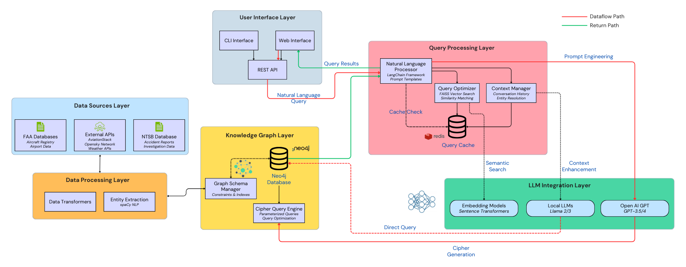

# GraphRAG: KG-based RAG for Querying Aviation Safety Data

A multi-phase Knowledge Graph-based Retrieval-Augmented Generation (RAG) system designed to query aviation accident/safety data using natural language. This repository supports the paper “Building Trust in the Skies: A Knowledge-Grounded LLM-based Framework for Aviation Safety.” Portions of the code were developed and prototyped in Google Colab with assistance from Google Gemini.


## 📌 Project Overview
Traditional RAG systems often struggle with structured data relationships. This project implements a **GraphRAG** approach, transforming tabular aviation records into a Neo4j Knowledge Graph. By combining the reasoning capabilities of LLMs (via Groq) with the relational depth of a Knowledge Graph, the system can answer complex safety queries that standard vector searches cannot.



## 🏗️ Project Structure & Phases

### [Phase 01: Data Preprocessing](./phase-01/)
* **Focus:** Data cleaning and standardization.
* **Key Tasks:** Parsing NTSB records, standardizing manufacturer names, and generating unique entity IDs for nodes and relationships.
* **Outcome:** Structured CSV files ready for graph ingestion.

### [Phase 02: Knowledge Graph Implementation](./phase-02/)
* **Focus:** Building the graph database.
* **Key Tasks:** Configuring Neo4j Aura, implementing unique constraints/indexes, and populating the graph with entities like `Accident`, `Aircraft`, and `Manufacturer`.
* **Outcome:** A fully queryable Neo4j database with mapped relationships.

### [Phase 03: RAG Interface & Analytics](./phase-03/)
* **Focus:** Interaction and UI.
* **Key Tasks:** Developing a Natural Language to Cypher engine using Groq/Llama-3 and a Flask-based web dashboard.
* **Outcome:** An interactive web interface where users can ask safety questions in plain English.


## 🛠️ Global Tech Stack
- **Database:** Neo4j (Graph), Cypher
- **LLM Engine:** Groq (Llama 3 / Mixtral)
- **Frameworks:** LangChain, Flask, Pandas, NetworkX
- **Visualization:** Matplotlib, Seaborn

## 🚀 Quick Start
1. **Clone the Repo:**
   ```bash
   git clone [https://github.com/dumindus/aviation-safety-kg-rag.git](https://github.com/dumindus/aviation-safety-kg-rag.git)
   ```

2. Install Dependencies:
   ```bash
   pip install -r requirements.txt
   ```

3. Environment Setup: Create a `.env` file with your `NEO4J_URI`, `NEO4J_USER`, `NEO4J_PASSWORD`, and `GROQ_API_KEY`.

4. Run the Dashboard:
   ```bash
   python phase-03/kg_based_phase_03.py
   ```

## 🔒 Security Notice
This repository follows security best practices. All API keys and database credentials have been removed from the source code. Users must provide their own credentials via environment variables to run the system.
