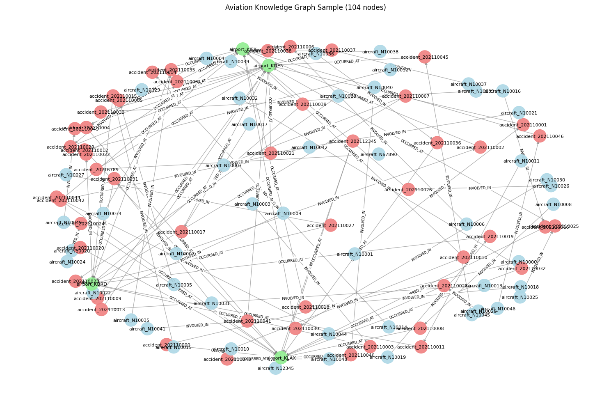

# KG-based RAG for Querying Aviation Safety Data | Phase 02: Graph Implementation

This phase focuses on the **Knowledge Graph (KG) Construction** using Neo4j. It takes the preprocessed entities from Phase 01 and builds a structured, high-performance database optimized for complex aviation safety queries.


## 🎯 Objectives
* **Establish Connectivity:** Create a secure bridge between Google Colab and Neo4j Aura (Cloud).
* **Data Integrity:** Implement unique constraints and high-speed indexes for reliable data retrieval.
* **Knowledge Graph Population:** Transform tabular NTSB data into a network of Accidents, Aircraft, and Manufacturers.
* **Metadata Generation:** Export a graph schema blueprint (`aviation_kg_metadata.json`) to guide the LLM in Phase 03.

## 🛠️ Technical Stack
* **Graph Database:** Neo4j (Aura DB)
* **Query Language:** Cypher
* **Python Libraries:** `neo4j`, `py2neo`, `langchain-openai`, `networkx`
* **Visualization:** `matplotlib`, `seaborn`

## 🏗️ Knowledge Graph Architecture

The system builds a multi-relational graph where:
- **Nodes:** Represent entities like `Accident`, `Aircraft`, `Manufacturer`, and `Event`.
- **Relationships:** Represent connections such as `(Aircraft)-[:MANUFACTURED_BY]->(Manufacturer)` or `(Aircraft)-[:INVOLVED_IN]->(Accident)`.


## 🚀 Getting Started

### 1. Prerequisites
You will need a Neo4j instance (Aura DB recommended) and a Groq API key for the semantic components.

### 2. Installation
```bash
pip install neo4j py2neo langchain-openai tqdm networkx matplotlib seaborn
```

### 3. Setup
Configure your credentials in the script:
```python
NEO4J_URI = "your_neo4j_uri"
NEO4J_PASSWORD = "your_password"
GROQ_API_KEY = "your_groq_api_key"
```

## 📊 Outputs
Upon running phase_02.py, the following are generated:
1. Aviation KG Metadata: A JSON file describing the graph structure.
2. Schema Validation: Reports on node counts, relationship density, and property coverage.
3. Cypher Scripts: Optimized queries for data ingestion and index creation.

## 📅 Roadmap
* [x] Phase 01: Data Cleaning & Preprocessing
* [x] Phase 02: Neo4j Graph Implementation
* [ ] Phase 03: RAG Interface & Natural Language Querying (Cypher Generation)

## Aviation Knowledge Graph (Sample with 100 nodes)
### Graph Statistics:
* Total Nodes: {'count': 151559}
* Total Relationships: {'count': 137397}
* Node Types: {'type': 'Accident', 'count': 68733}
* Relationship Types: {'type': 'OCCURRED_AT', 'count': 68681}
* Graph Density: {'density': 5.981590164560622e-06}
* Average Degree: {'avg_degree': 1.813115684320973}


